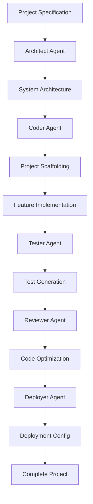

# AI Code Generation Service - Powered by Claude Code SDK

## Overview

The AI Code Generation Service is a core component of TrinityAI that enables automatic generation of complete web applications, mobile apps, APIs, and individual components using the Claude Code SDK. This service orchestrates multiple AI agents to handle different aspects of software development, from architecture design to deployment configuration.

## 🚀 Key Features

### Claude Code SDK Integration
- **Multi-Agent Orchestration**: Leverages specialized Claude Code SDK agents for different tasks
- **Autonomous Code Generation**: Full application generation from specifications
- **Intelligent Component Creation**: Smart component generation with context awareness
- **Code Review & Optimization**: Automatic code quality improvements
- **Test Generation**: Comprehensive test suite creation
- **Deployment Configuration**: Automatic Docker, Kubernetes, and CI/CD setup

### Supported Project Types
- Web Applications (React, Next.js, Vue, Angular, Svelte)
- Mobile Apps (React Native, Flutter)
- Backend APIs (Express, FastAPI, Django, Spring)
- Microservices
- CLI Tools
- Chrome Extensions
- Desktop Apps (Electron, Tauri)
- Games
- AI Models
- Blockchain DApps

## 🤖 Claude Code SDK Agents

The service uses five specialized Claude Code SDK agents:

### 1. **Architect Agent** 🏗️
- Designs system architecture
- Creates database schemas
- Plans API structure
- Defines component hierarchy
- Recommends technology stack

### 2. **Coder Agent** 💻
- Implements business logic
- Creates UI components
- Builds API endpoints
- Writes database queries
- Integrates third-party services

### 3. **Reviewer Agent** 🔍
- Performs security analysis
- Optimizes performance
- Ensures code quality
- Applies best practices
- Suggests refactoring

### 4. **Tester Agent** 🧪
- Generates unit tests
- Creates integration tests
- Builds E2E test suites
- Sets up test automation
- Ensures test coverage

### 5. **Deployer Agent** 🚀
- Creates Docker configurations
- Generates Kubernetes manifests
- Sets up CI/CD pipelines
- Configures monitoring
- Manages infrastructure as code

## 📡 API Endpoints

### Generate Complete Application
```http
POST /api/v1/codegen/generate-app
Content-Type: application/json

{
  "name": "my-awesome-app",
  "type": "web-app",
  "description": "A social media dashboard",
  "framework": "react",
  "language": "typescript",
  "features": [
    {
      "name": "User Authentication",
      "description": "JWT-based auth with social login",
      "priority": "high"
    },
    {
      "name": "Real-time Dashboard",
      "description": "Live analytics and metrics",
      "priority": "high"
    }
  ],
  "database": "postgresql",
  "authentication": "jwt",
  "styling": "tailwind"
}
```

**Response:**
```json
{
  "success": true,
  "message": "App generated successfully with Claude Code SDK",
  "project": {
    "id": "uuid-here",
    "name": "my-awesome-app",
    "status": "generated",
    "filesCount": 47,
    "downloadUrl": "/api/v1/projects/uuid-here/download"
  }
}
```

### Generate Component
```http
POST /api/v1/codegen/generate-component
Content-Type: application/json

{
  "name": "UserProfile",
  "componentType": "component",
  "description": "User profile card with avatar and stats",
  "requirements": [
    "Display user avatar",
    "Show user statistics",
    "Edit profile button",
    "Responsive design"
  ],
  "context": {
    "framework": "react",
    "language": "typescript",
    "styling": "tailwind"
  }
}
```

### Generate from Natural Language
```http
POST /api/v1/codegen/generate-from-description
Content-Type: application/json

{
  "description": "I need a task management app like Trello with boards, lists, and cards. Users should be able to drag and drop cards between lists, add comments, and attach files. Include user authentication and real-time updates."
}
```

### Generate Tests
```http
POST /api/v1/codegen/generate-tests
Content-Type: application/json

{
  "code": "// Your code here",
  "framework": "jest",
  "type": "unit"
}
```

### Review Code
```http
POST /api/v1/codegen/review-code
Content-Type: application/json

{
  "code": "// Your code here",
  "context": {
    "language": "typescript",
    "framework": "react"
  }
}
```

## 🔄 Generation Workflow



## 🛠️ Configuration

### Environment Variables
```env
# Claude Code SDK
ANTHROPIC_API_KEY=your-api-key
CLAUDE_CODE_MODE=autonomous
CLAUDE_WORKSPACE=/path/to/workspace

# GitHub Integration
GITHUB_TOKEN=your-github-token

# Redis
REDIS_HOST=localhost
REDIS_PORT=6379

# Project Storage
PROJECTS_PATH=/path/to/generated-projects

# Features
ENABLE_GIT=true
ENABLE_DEPLOYMENT=true
```

## 📦 Installation

### Using Docker
```bash
docker build -t trinityai-codegen .
docker run -p 8005:8005 \
  -e ANTHROPIC_API_KEY=your-key \
  -v /path/to/workspace:/workspace \
  trinityai-codegen
```

### Local Development
```bash
npm install
npm run dev
```

## 🔗 Integration with TrinityAI

The AI Code Generation Service integrates with other TrinityAI components:

### Knowledge Graph Integration
- Generates code based on ontologies and schemas stored in the Knowledge Graph
- Creates applications that can query and update the Knowledge Graph

### Social Graph Integration
- Builds social features based on relationship data
- Generates user interaction components

### AI Graph Integration
- Creates ML-powered features
- Generates code for AI model integration

## 📊 Monitoring

### Metrics Endpoint
```http
GET /metrics
```

Provides Prometheus metrics including:
- Generation success rate
- Average generation time
- Agent utilization
- Error rates
- Project statistics

### Health Check
```http
GET /health
```

## 🚀 Deployment Targets

Generated applications can be automatically deployed to:
- **Vercel** - Frontend applications
- **Netlify** - Static sites and JAMstack
- **AWS** - Full stack applications
- **Google Cloud** - Scalable services
- **Docker** - Containerized applications
- **Kubernetes** - Orchestrated microservices
- **Heroku** - Quick deployments
- **GitHub Pages** - Static sites

## 📝 Examples

### 1. Generate a Full-Stack E-commerce App
```javascript
const spec = {
  name: "ecommerce-platform",
  type: "web-app",
  framework: "nextjs",
  language: "typescript",
  features: [
    { name: "Product Catalog", priority: "high" },
    { name: "Shopping Cart", priority: "high" },
    { name: "Payment Integration", priority: "high" },
    { name: "Order Management", priority: "medium" },
    { name: "User Reviews", priority: "low" }
  ],
  database: "postgresql",
  authentication: "jwt"
};
```

### 2. Generate a REST API
```javascript
const spec = {
  name: "user-management-api",
  type: "api",
  framework: "express",
  language: "typescript",
  features: [
    { name: "CRUD Operations", priority: "high" },
    { name: "Authentication", priority: "high" },
    { name: "Rate Limiting", priority: "medium" },
    { name: "API Documentation", priority: "medium" }
  ],
  database: "mongodb"
};
```

### 3. Generate a Mobile App
```javascript
const spec = {
  name: "fitness-tracker",
  type: "mobile-app",
  framework: "react-native",
  language: "typescript",
  features: [
    { name: "Activity Tracking", priority: "high" },
    { name: "Goal Setting", priority: "high" },
    { name: "Progress Charts", priority: "medium" },
    { name: "Social Sharing", priority: "low" }
  ]
};
```

## 🔒 Security

- All generated code undergoes security analysis
- Sensitive data is never hardcoded
- Environment variables are used for configuration
- Security best practices are enforced
- Dependency vulnerability scanning

## 🤝 Contributing

See [CONTRIBUTING.md](../../CONTRIBUTING.md) for guidelines on contributing to TrinityAI.

## 📄 License

Part of the TrinityAI - AI Awareness System

---

## 🎯 Claude Code SDK Features Utilized

### 1. **Autonomous Mode**
- Agents operate independently to complete tasks
- Multi-step workflows without manual intervention
- Self-correcting code generation

### 2. **File Operations**
- Automatic file creation and organization
- Project structure generation
- Template instantiation

### 3. **Command Execution**
- Running build commands
- Installing dependencies
- Git operations

### 4. **Context Awareness**
- Understanding project context
- Maintaining consistency across components
- Intelligent code suggestions

### 5. **Multi-Agent Coordination**
- Agents communicate through shared context
- Workflow orchestration
- Task delegation

## 🔮 Future Enhancements

- **Visual IDE Integration**: Direct integration with VS Code and other IDEs
- **Real-time Collaboration**: Multiple users working on generated projects
- **AI Pair Programming**: Interactive coding sessions with Claude
- **Custom Agent Training**: Train agents on specific codebases
- **Visual Application Builder**: Drag-and-drop interface generation
- **Code Migration**: Automatic code migration between frameworks
- **Performance Profiling**: Automatic performance optimization
- **Security Auditing**: Continuous security monitoring of generated code

---

*Powered by Claude Code SDK - Bringing AI-driven development to TrinityAI*